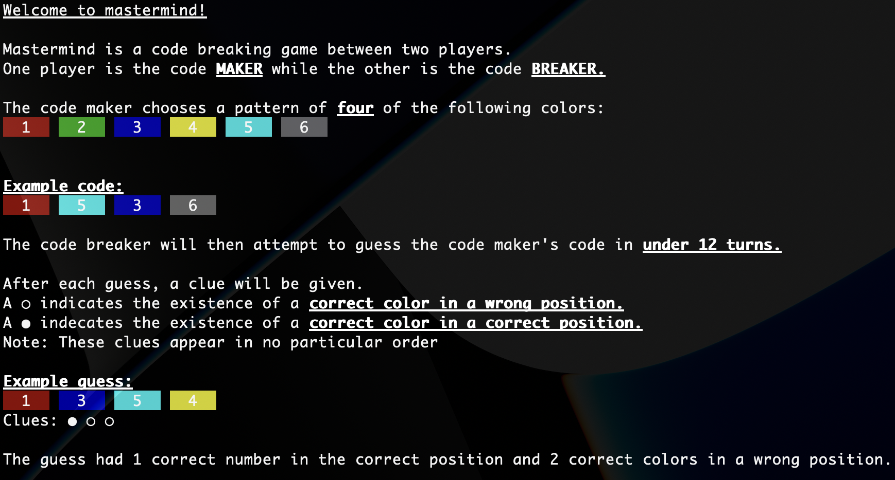

# Ruby Mastermind

This is my Ruby implementation of the code-breaking game Mastermind. This project is part of the [The Odin Project](https://www.theodinproject.com/lessons/ruby-mastermind) curriculum.



[](https://replit.com/@christanr00/rubymastermind)

## Installation

```bash
git clone git@github.com:crobin00/ruby_mastermind.git
ruby main.rb
```

## Usage

Choose between playing as the `maker` or the `breaker`.

Breakers will only have 12 chances to guess the makers code.

Code patterns require a 4-digit number only with digits between 1-6. You may have as much space between the digits as you'd like.

These are all valid syntaxes for a code:

```bash
1432
5 3 5 6
25 31
1   6 4  3
```

## To-do

- Add ability for user to quit program before game ends
